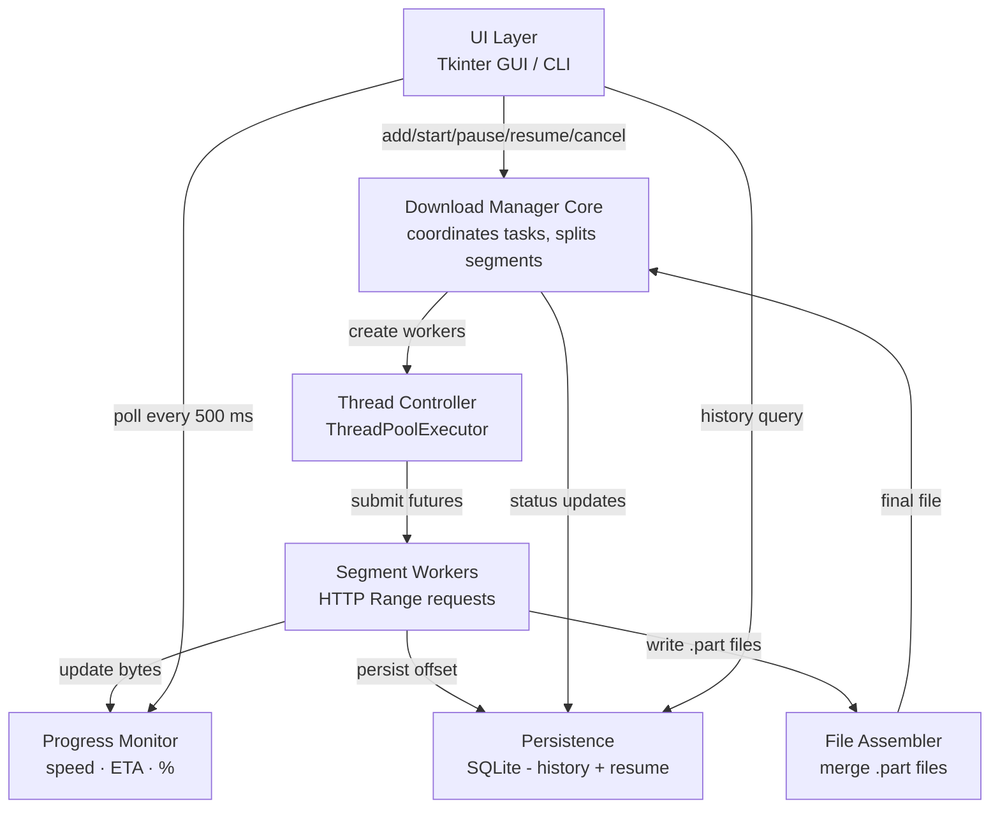

# SDM - Simple Download Manager

> A university Distributed Systems project demonstrating multithreading, HTTP Range requests,  
> file segmentation, fault tolerance, and real-time progress monitoring.  
> Inspired by IDM and XDM, built with pure Python.

---

## Features

### Core
- Add a download by URL
- Split file into **N parallel segments** (default: 4, configurable up to 16)
- Download each segment simultaneously using **ThreadPoolExecutor**
- Merge segments into the final file in the correct order
- **Cancel** downloads and clean up temporary files automatically

### Reliability
- **Pause / Resume** mid-download using `threading.Event` (zero CPU while paused)
- **Resume after restart** - interrupted downloads are restored from SQLite on the next launch
- **Automatic retry** with exponential back-off (up to 3 retries per segment)
- Graceful fallback to single-segment download for servers that don't support Range requests

### Progress Monitoring
- Live download speed (10-sample rolling average)
- Progress percentage
- Estimated time remaining (ETA)
- Human-readable byte counts

### History
- All downloads (completed, failed, cancelled) recorded in SQLite
- History tab in the GUI with sortable columns
- Delete individual records or clear all history

### Interface
- **Tkinter desktop GUI** (no extra dependencies)
- **CLI mode** (`--cli`) for headless/SSH environments
- **Benchmark script** comparing single-threaded vs multi-threaded performance

---

## Architecture



---

## Component Descriptions

| Layer | File | Responsibility |
|---|---|---|
| **UI** | `ui/gui.py` | Tkinter window with toolbar, Active/History tabs, 500 ms polling loop |
| **UI (fallback)** | `ui/cli.py` | CLI with animated progress bar, `--cli` flag |
| **Download Manager** | `core/download_manager.py` | Central coordinator: FSM transitions, segment splitting, daemon threads |
| **Thread Controller** | `core/thread_controller.py` | `ThreadPoolExecutor`, submits workers, collects results via `as_completed()` |
| **Segment Workers** | `core/segment_worker.py` | HTTP Range request, chunk loop, pause/cancel checks, retry logic |
| **File Assembler** | `core/file_assembler.py` | Merges `.part` files in order, verifies size, cleans up |
| **Progress Tracker** | `monitoring/progress_tracker.py` | Rolling-window speed, ETA, thread-safe `update()` |
| **Database** | `persistence/database.py` | All SQLite reads/writes, thread-safe via `threading.Lock` |
| **HTTP Utils** | `utils/http_utils.py` | HEAD probe, filename extraction, Range header builder |
| **Models** | `core/models.py` | `DownloadTask`, `SegmentInfo`, `DownloadStatus`, `SegmentStatus` |

---

## Thread Model

```
main thread  (Tkinter event loop)
│
│  self.after(500ms)  ──► _poll_progress()  ──► get_progress() ──► update widgets
│
│  on_add_url()
│    └─► manager.add_download()     [synchronous, fast - just a HEAD request]
│    └─► manager.start_download()
│              │
│              └─► threading.Thread(target=_run_download, daemon=True)
│                         │
│                         └─► ThreadPoolExecutor(max_workers=N)
│                                  ├─► SegmentWorker(seg=0).run()  [worker thread]
│                                  ├─► SegmentWorker(seg=1).run()  [worker thread]
│                                  ├─► SegmentWorker(seg=2).run()  [worker thread]
│                                  └─► SegmentWorker(seg=3).run()  [worker thread]
```

**Key invariant:** Worker threads never touch Tkinter widgets. All widget mutations  
happen on the main thread inside `_poll_progress()`.

### Pause / Resume

```
pause_event.set()    → workers run (event is "green light")
pause_event.clear()  → workers block at pause_event.wait()

Pause:  manager.pause_download(id)  → pause_event.clear()
Resume: manager.resume_download(id) → pause_event.set()
```

`pause_event.wait()` is called after every chunk write. While paused, threads  
consume zero CPU - they sleep inside the OS kernel waiting for the event.

### Retry Mechanism

Each segment retries up to `max_retries` (default: 3) times with linear back-off:

```
attempt 1 → fail → sleep 2 s
attempt 2 → fail → sleep 4 s
attempt 3 → fail → segment marked FAILED → download marked FAILED
```

Retries are **partial** - `actual_start = start_byte + downloaded`, so only  
the un-downloaded portion is re-requested, not the full segment.

---

## HTTP Range Requests

```
Client                                Server
──────                                ──────
HEAD /file.bin  ──────────────────►  200 OK
                                      Content-Length: 104857600
                ◄─────────────────── Accept-Ranges: bytes

GET  /file.bin  ──────────────────►  206 Partial Content
Range: bytes=0-26214399               [segment 0 data]

GET  /file.bin  ──────────────────►  206 Partial Content
Range: bytes=26214400-52428799        [segment 1 data]

... (parallel) ...

[all 4 segments downloaded simultaneously]
[merge: part0 + part1 + part2 + part3 → file.bin]
```

The HTTP `Range` header (`RFC 7233`) instructs the server to return only the  
specified byte range. A `206 Partial Content` response confirms range support.

---

## Setup

**Requirements:** Python 3.10 or later.

```bash
# Clone / copy the project
cd SDM

# Install the only external dependency
pip install -r requirements.txt
```

---

## How to Run

### GUI (recommended)
```bash
python main.py
```

### CLI - single download
```bash
python main.py --cli --url https://example.com/file.zip
python main.py --cli --url https://example.com/file.zip --segments 8
python main.py --cli --url https://example.com/file.zip --output ./my_downloads
```

### CLI - view history
```bash
python main.py list
# or
python main.py --cli list
```

### Benchmark
```bash
python benchmark.py
```

### Verbose logging
```bash
python main.py --verbose
```

---

## How to Test

1. **Basic download (GUI)**
   - Launch `python main.py`
   - Click **+ Add URL**, enter `https://nbg1-speed.hetzner.com/100MB.bin`
   - Watch the progress bar and speed update every 500 ms
   - Verify the file appears in `downloads/` after completion

2. **Pause / Resume**
   - Start a large download (e.g. 100 MB)
   - Click **Pause** - speed drops to 0, status shows "paused"
   - Click **Resume** - download continues from the same byte offset
   - Verify `sdm.db` segments table shows updated `downloaded` column

3. **Resume after restart**
   - Start a download, click **Pause**, then close the application
   - Reopen `python main.py` - the paused download reappears
   - Click **Resume** - download continues without re-downloading already-saved bytes

4. **Cancel**
   - Start a download, click **Cancel**
   - Verify no `.part` files remain in `downloads/`
   - Verify the record in History shows status "cancelled"

5. **Benchmark**
   - Run `python benchmark.py`
   - Compare the printed table: multi-threaded downloads should be significantly faster

6. **History**
   - Switch to the **History** tab - all past downloads are listed
   - Click column headers to sort b0y name, status, or date
   - Use **Delete Selected** or **Clear All** to manage records

---

## Project Structure

```
SDM/
├── main.py                    # Entry point
├── requirements.txt           # requests only
├── benchmark.py               # Performance comparison script
├── core/
│   ├── models.py              # DownloadTask, SegmentInfo, enums
│   ├── download_manager.py    # Central coordinator
│   ├── thread_controller.py   # ThreadPoolExecutor manager
│   ├── segment_worker.py      # HTTP Range worker with retry
│   └── file_assembler.py      # Merge .part files
├── persistence/
│   └── database.py            # SQLite layer
├── monitoring/
│   └── progress_tracker.py    # Speed, ETA, % metrics
├── ui/
│   ├── gui.py                 # Tkinter desktop GUI
│   └── cli.py                 # CLI fallback
├── utils/
│   ├── http_utils.py          # HEAD probe, filename, Range headers
│   └── logger.py              # RotatingFileHandler setup
└── downloads/                 # Created at runtime
```

---

## CS404 - Distributed Systems Concepts Demonstrated

| Concept | Where |
|---|---|
| **Multithreading** | `ThreadPoolExecutor` in `thread_controller.py`; daemon coordinator thread per download |
| **Thread synchronisation** | `threading.Event` (pause), `threading.Lock` (shared state), DB-level lock |
| **HTTP Range requests** | `segment_worker.py` - `Range: bytes=start-end` header, 206 response handling |
| **Fault tolerance** | Segment retry with exponential back-off in `segment_worker.py` |
| **State persistence** | SQLite stores byte offsets; `download_manager.restore_incomplete()` on startup |
| **Progress monitoring** | Rolling-window speed, ETA in `progress_tracker.py` |
| **File I/O** | Append-mode `.part` files, binary merge with `shutil.copyfileobj` |
| **Clean architecture** | 7 independent, testable layers with clear interfaces |

---

*CS404 Distributed Systems - Simple Download Manager (SDM)*  
*Python 3.10+ · requests · sqlite3 · tkinter · threading*
